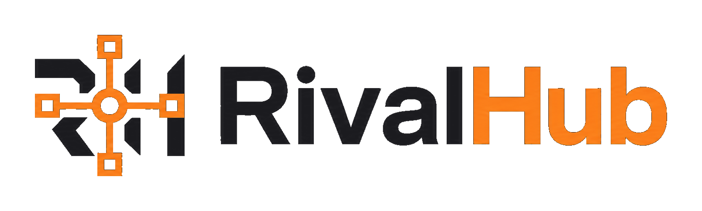
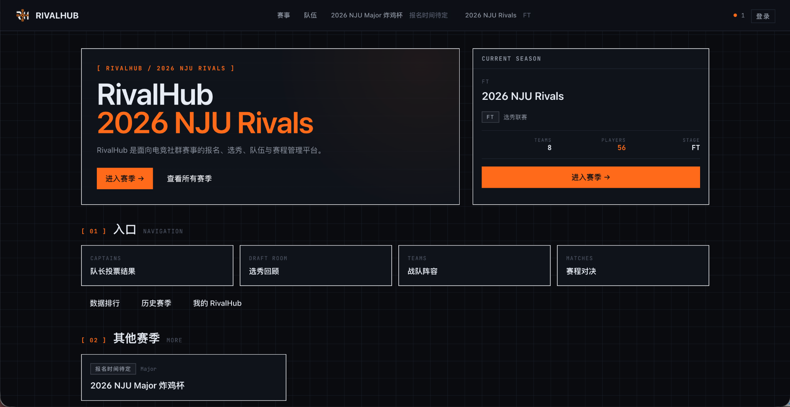
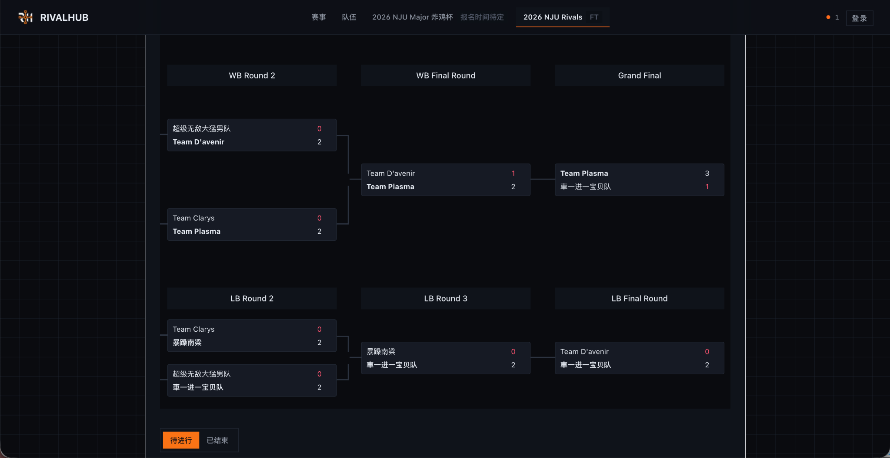
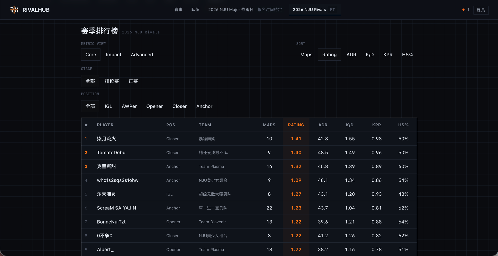

<p align="center">
  <picture>
    <source media="(prefers-color-scheme: dark)" srcset="./public/brand/rivalhub/rivalhub-lockup-horizontal-transparent-tight.png" />
    <source media="(prefers-color-scheme: light)" srcset="./public/brand/rivalhub/rivalhub-lockup-horizontal-transparent-tight-light.png" />
    
  </picture>
</p>

<p align="center">
  <strong>面向高校电竞赛事的开源赛事运营平台</strong><br />
  <sub>Open-source tournament operations for collegiate esports.</sub>
</p>

<p align="center">
  <a href="https://github.com/Starfie1d1272/RivalHub/releases"></a>
  <a href="https://github.com/Starfie1d1272/RivalHub/actions/workflows/ci.yml"></a>
  <a href="./LICENSE"></a>
  
  
  
  
  
  <a href="./CONTRIBUTING.md"></a>
</p>

<p align="center">
  <a href="https://match.starfie1d.top">Live Site</a> ·
  <a href="./docs/README.md">Docs</a> ·
  <a href="./docs/roadmap.md">Roadmap</a> ·
  <a href="./CONTRIBUTING.md">Contributing</a>
</p>



RivalHub 是一个面向高校电竞赛事的开源赛事平台。目前主要用于 NJU Rivals 和 NJU Major，覆盖报名、组队、资格审核、赛程、比赛管理、数据统计和赛事历史。

Rivals 与 Major 共用账号、长期 Team、比赛和数据基础设施，同时保留各自不同的报名方式和赛制流程。

## 主要功能

- **选手与竞技档案** — 统一维护身份、教育资格和竞技资料，并在不同赛事之间复用。
- **Team 与参赛管理** — Team 长期存在，每届赛事单独管理参赛名单、成员确认和审核状态。
- **报名与资格审核** — 支持个人或队伍报名、资格核验、补正、候补和管理员审核。
- **赛事流程** — 已覆盖选秀、循环赛、Swiss、双败淘汰和 Playoffs 等流程。
- **比赛管理** — 支持时间协商、阵容与 BP、地图和系列赛结果、弃赛、更正、恢复与纪律处理。
- **数据统计** — 提供赛季排行榜、比赛结果和选手统计，并持续完善跨赛事历史展示。

## Rivals 与 Major

| 体系 | 参赛方式 | 主要流程 |
| --- | --- | --- |
| **Rivals** | 个人报名 | 审核 → 队长投票 → 蛇形选秀 → 循环赛 → 双败淘汰 |
| **Major** | 长期 Team 组队报名 | 成员确认 → 资格审核 → 管理审核 → 赛前冻结 → 三阶段 Swiss → Playoffs |

2026 NJU Rivals 已完整通过 RivalHub 运行，覆盖从报名、选秀到比赛、统计和赛季收尾的完整流程。

## 赛事运行

从选秀、循环赛到双败淘汰，赛程和晋级关系都在 RivalHub 内推进；Major 则进一步覆盖 Team 报名、资格审核、Swiss 和 Playoffs。管理员可以在后台处理名单、比赛结果、更正和恢复等赛务工作。



## 数据与历史

比赛结果和选手数据会继续用于赛季排行榜与统计页面。更完整的 Player、Team 与 Event 跨赛事历史仍在 2.x 中继续完善。



## 项目范围

RivalHub 2.x 先把官方实例和真实赛事运营做好。代码以 AGPL-3.0 开源，可用于阅读、研究、修改和本地开发；第三方 production self-hosting 暂不作为 2.x 的正式支持目标。

后续产品方向见 [`docs/roadmap.md`](./docs/roadmap.md)，具体开发状态以 GitHub Issues 为准。

## 本地开发

### 环境要求

| 依赖 | 版本 |
| --- | --- |
| Node.js | `24.x` |
| pnpm | `11.x` |
| Docker | Local Supabase 需要 |

### 快速开始

```bash
pnpm install
pnpm db:local:bootstrap
pnpm dev:local
```

本地开发使用仓库提供的 Local Supabase 配置。完整环境、数据库迁移、CI 和发布说明从 [`docs/README.md`](./docs/README.md) 进入对应文档。

## 文档

| 文档 | 用途 |
| --- | --- |
| [`docs/README.md`](./docs/README.md) | 文档入口 |
| [`docs/roadmap.md`](./docs/roadmap.md) | 2.x 主线与 3.x 展望 |
| [`docs/architecture.md`](./docs/architecture.md) | 系统架构 |
| [`docs/domain-model.md`](./docs/domain-model.md) | 核心领域模型 |
| [`CONTRIBUTING.md`](./CONTRIBUTING.md) | 开发与提交规范 |

## 安全

安全问题请不要在公开 Issue 中披露技术细节，按仓库的 [Security Policy](https://github.com/Starfie1d1272/RivalHub/security/policy) 使用私密渠道报告。

## 许可证

[GNU Affero General Public License v3.0](./LICENSE)
