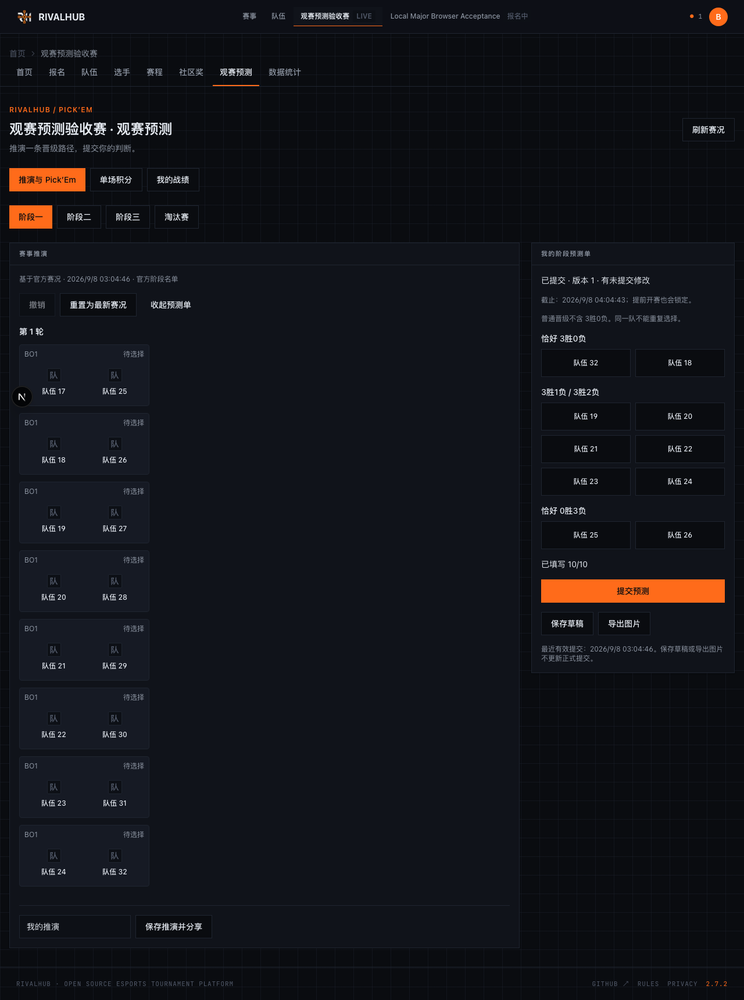
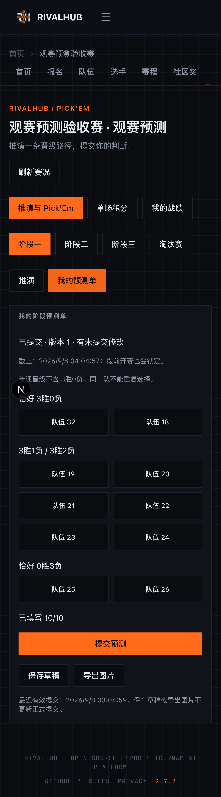

# 观赛预测首版界面快照

截图来自 2026-09-08 本地 Playwright 验收，使用虚构赛事与队伍。页面中的时间、版本和队伍仅为当时测试数据，不代表生产赛事。桌面为左侧推演、右侧独立 Pick’Em；手机通过“推演 / 我的预测单”切换。

本目录是评审材料，不是当前架构或发布状态的 authority。功能当前状态和 Stage / scheduler / migration 接入事项以对应 PR 为准。

## 桌面



## 手机



## 本地复现交互

Docker Desktop 运行后，在本 PR 的 checkout 中执行：

```bash
pnpm install --frozen-lockfile
pnpm db:local:bootstrap
pnpm exec playwright install chromium
pnpm test:e2e -- tests/e2e/flows/predictions.spec.ts --project=chromium --headed --workers=1
```

浏览器测试会自动创建本地账号与 32 支测试队伍，执行观众提交、推演分享、积分投入和管理员开窗/暂停/作废；结束后自动清理。测试使用独立本地 Supabase，账号与临时凭据不提交到 Git。

该 checkout 尚未接入最新 main / #575 的迁移链，不能对已按最新主线迁移的数据库直接运行本分支 migration；应使用与本分支兼容的隔离本地环境。
