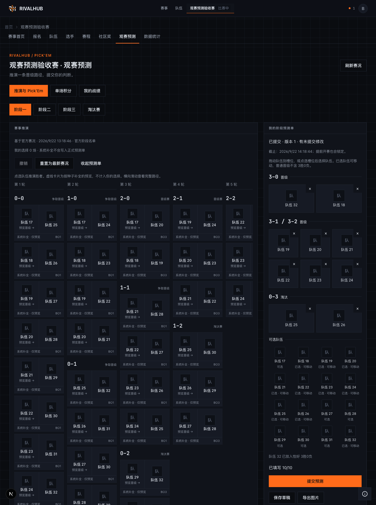

# 观赛预测完整棋盘与队徽预测单

2026-09-22 本地真实浏览器验收截图，数据来自隔离测试库中的虚构赛事与队伍。队徽缺失时显示项目既有的首字 fallback；这组截图不证明真实远程队徽的跨域导出兼容性，也不代表生产数据或用户视觉验收。

桌面在左侧展示全部轮次，按当前战绩分组，横向滚动查看晋级／淘汰出口；右侧使用独立预测槽位。系统按种子补全的未来路径标为“仅预览”，不算作用户选择。手机切换推演与预测单，页面本身不横向溢出。

[手机完整预测单](mobile-full.png) · [淘汰赛路径](playoff.png) · [草稿分享图片](share.png)

验证覆盖点选／键盘／桌面拖拽、草稿与提交隔离、PNG 下载、积分投入、撤销、分享恢复与管理员操作；淘汰赛分支依赖另有组件与领域测试。测试入口与本地服务约束见 [`testing`](../../testing.md) 和 [`观赛预测运营`](../../operations/spectator-predictions.md)。正式市场仍只开放官方比赛胜者；多选项模型不是新增玩法已经开放的证明。
