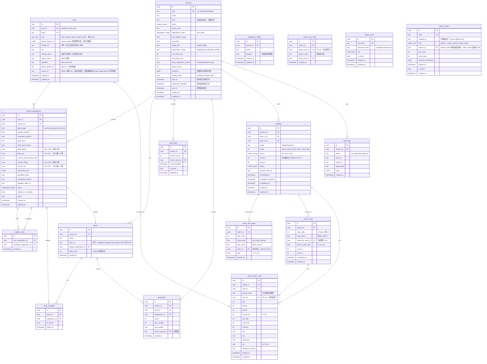

# 数据模型

## ER 图（Mermaid）

---

## 枚举与约束速查

| 字段 | 可选值 | 说明 |
|---|---|---|
| `user_role` | `user` / `season_admin` / `super_admin` | `season_admin` 管辖 `adminSeasonIds` 内赛季 |
| `season_status` | `draft` / `registration` / `voting` / `drafting` / `playing` / `finished` / `archived` | 见 `docs/state-machines.md` |
| `registration_mode` | `solo` / `team` | 个人 / 队伍整体报名 |
| `registration_status` | `pending` / `approved` / `rejected` / `waitlisted` | |
| `admin_role` | `super_admin` / `admin` | |
| `match_status` | `scheduled` / `in_progress` / `finished` / `cancelled` | |
| `match_format` | `bo1` / `bo3` / `bo5` | |
| `matches.stage` | `qualifier` / `playoff` | 存 `StagePlan[n].key`，非展示名 |
| `side` | `t` / `ct` | 进攻方 / 防守方 |
| `season.positions[]` | `igl` / `awper` / `opener` / `closer` / `anchor` | CS2 五位置，赛季可配 |
| `season.kind` | 自由文本 | **仅展示用，禁做功能分支。读 capability 字段** |
| `season.stage_plan` | `StageConfig[]` JSON | `key`(业务标识) / `name`(展示) / `type`(`round_robin`\|`double_elim`\|`single_elim`\|`swiss`) / `teamCount` / `advance` / `seeds` |

### 唯一约束速查

`users(auth_id, email)` · `seasons(slug)` · `registration_drafts(season_id, email)` · `season_registrations(user_id, season_id)` · `captain_votes(voter, candidate)` · `draft_state(season_id)` · `draft_picks(client_request_id)` · `match_maps(match_id, map_order)` · `match_veto_steps(match_id, step_order)` · `admin_users(username)` · `admin_invites(code)` · `match_player_stats(map_id, perfect_name)` · `match_mvp_votes(match_id, voter_user_id)`

### 应用层约束（规则书）

每个主选位置上限 15 人，总报名上限 56 人（`registrationConfig.maxTotal`），每位选手每届 3 票，每队同位置 <= 2 人（选秀时校验），选秀 6 轮（队长 + 6 pick = 7 人）。时间字段统一 UTC，展示层 Asia/Shanghai。

### Phase 2 新增表

`match_time_proposals`（时间协商：`proposed_time`、`status`(pending/accepted/rejected/expired)、`reject_reason`）、`match_rosters` + `match_roster_players`（赛前名单：每场一条 roster，`is_starter` 区分首发 5 人 / 替补 <=2 人，`status`(submitted/unlocked)）。
